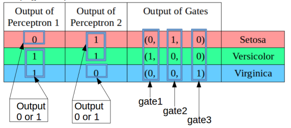

## Use perceptrons and logic gates to construct a classifier to solve the multi-classification problem

* Sample dataset: iris.csv

* Here is the overall truth table:



* Here is design diagram:


* Use of this classifier:
```python
#[5.9, 3.0, 5.1, 1.8] is the sample for testing 
>>>import gatesAsSndLayer as gate
>>>gate.forTestSample(sample=[5.9, 3.0, 5.1, 1.8], w1=w1,b1=b1,w2=w2,b2=b2)
[0, 0, 1]
```